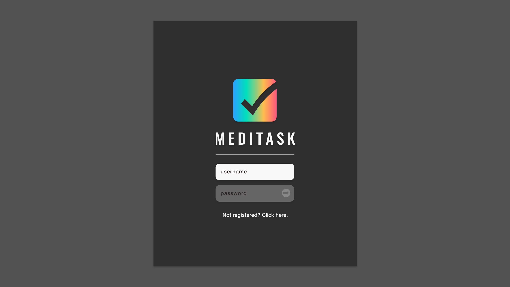
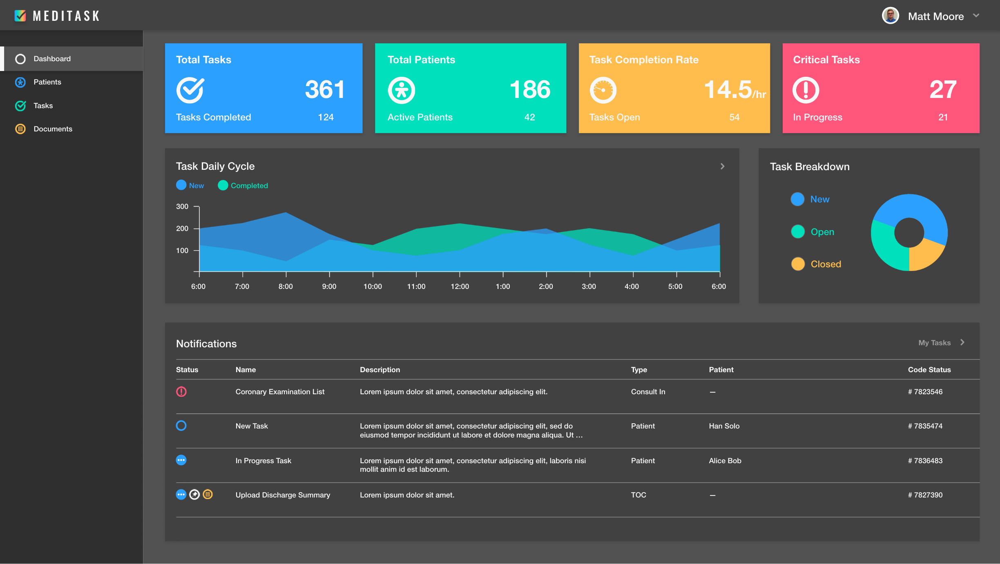
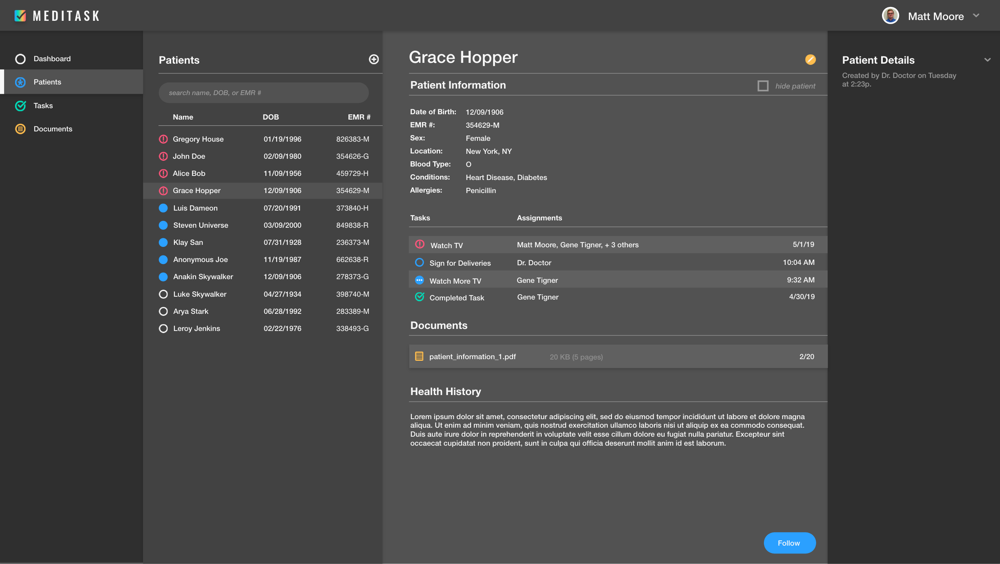
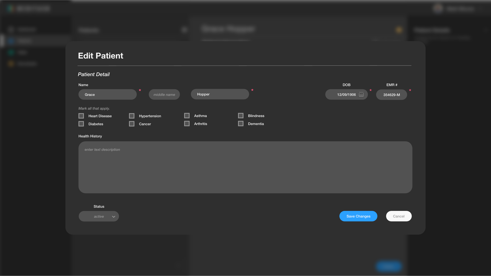
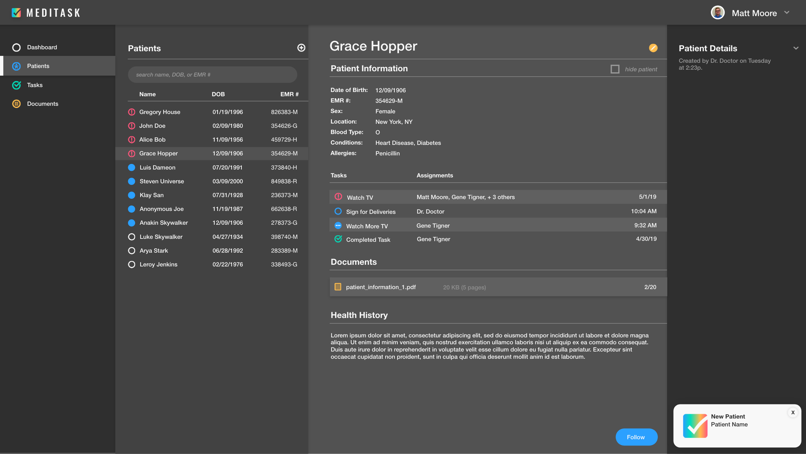
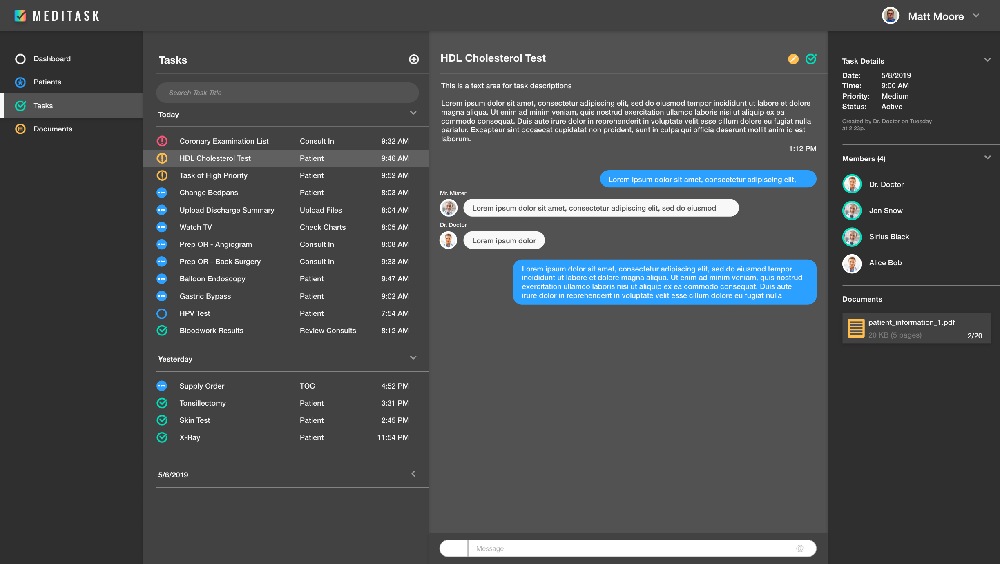
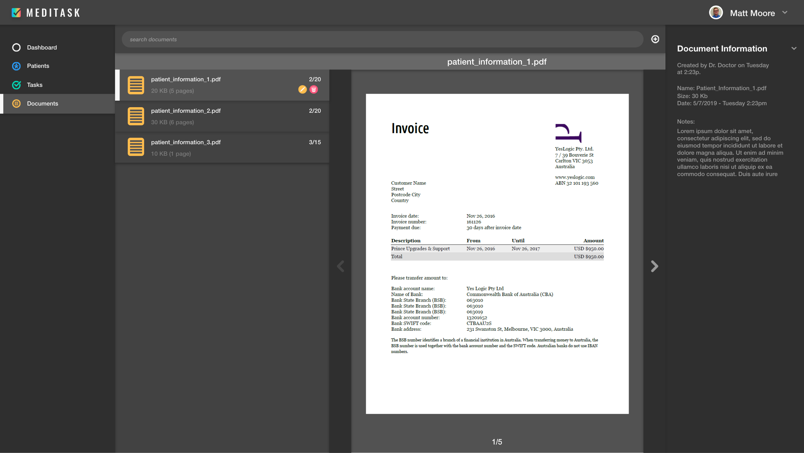

# SE_GUI
GUI design by Matt Moore and Gene Tigner.

Collaborative project for UTSA's CS 3773 - Software Engineering. Built in Adobe XD.

## Login

## Dashboard

## Patients

### Edit Patient

### Patient Created

## Tasks

## Documents

